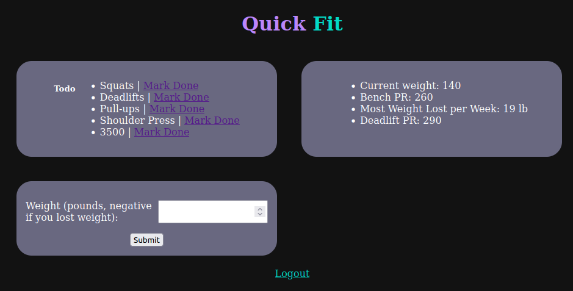

# QuickFit
*Project made for CalHacks 2023*

Our Fitness app is designed for anyone to achieve their dream body. 
We found that other fitness apps tend to be demotivating when reaching our goals in the gym. We wanted to create an experience that would give you many options about how to attain your ideal body weight through different exercises while giving you a reason to come back.

Using our app any user is able to create a profile, storing the user's height and weight for their bmi to be calculated. The app is intended to be used daily, as we have a ToDo list just for the exercises they have chosen for once they signed into their account.

The technologies used in this project is Django, Python, HTML, and CSS. 

